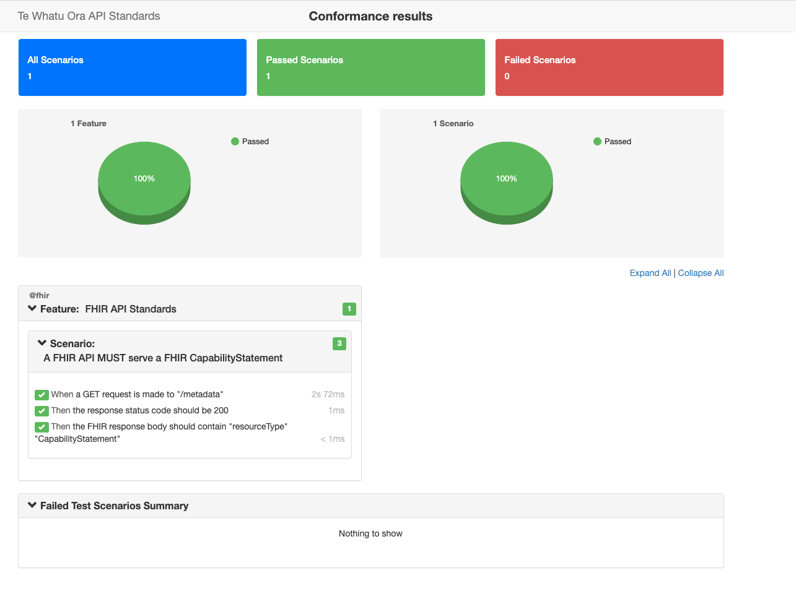

# Te Whatu Ora API Standards Conformance Tool

<a name="readme-top"></a>

<!-- PROJECT LOGO -->
<br />
<div align="center">
  <a href="https://github.com/tewhatuora/api-standards-conformance">
    <picture>
      <source media="(prefers-color-scheme: dark)" srcset="./assets/two-dark-theme-logo.svg">
      
    </picture>
  </a>

  <h3 align="center">Health New Zealand | Te Whatu Ora FHIR Implementation Guide to OpenAPI Converter</h3>

  <p align="center">
    This project is a conformance tool framework designed to assess an API against the Te Whatu Ora API Standards which are officially published at <a href="https://apistandards.digital.health.nz">https://apistandards.digital.health.nz</a>.
    <br />
</div>

<!-- GETTING STARTED -->

## Getting Started

### Running the tool as a Docker container

Pull the latest image:

`docker pull ghcr.io/tewhatuora/api-standards-conformance:latest`

Run a conformance test (note you must have a valid config.json in the current working directory):

`docker run -it -v $(pwd)/config.json:/usr/src/app/config.json -v $(pwd)/reports:/usr/src/app/reports ghcr.io/tewhatuora/api-standards-conformance`

To merge custom features with the base implementation, mount to `/opt/features`

`docker run -v$(pwd)/override:/opt/features -v $(pwd)/config.json:/usr/src/app/config.json -v $(pwd)/reports:/usr/src/app/reports ghcr.io/tewhatuora/api-standards-conformance`

To execute specific specific tags

`docker run -v$(pwd)/override:/opt/features -v $(pwd)/config.json:/usr/src/app/config.json -v $(pwd)/reports:/usr/src/app/reports ghcr.io/tewhatuora/api-standards-conformance --tags @fhir`

To skip specific specific tags

`docker run -v$(pwd)/override:/opt/features -v $(pwd)/config.json:/usr/src/app/config.json -v $(pwd)/reports:/usr/src/app/reports ghcr.io/tewhatuora/api-standards-conformance --tags '"not @not-implemented"'`

### Development

This tool is distributed as a Docker container, or you can build it yourself.

Install dependencies:

`yarn`

Run the tool without Docker:

`yarn test`
`yarn report`

Build the container locally:

`yarn build`

Run the container locally (test):

`yarn test:docker`

Run the container locally (report):

`yarn test:report`

## Features

The test suite is built on Cucumber, a popular behavior-driven development (BDD) tool that allows you to write tests in a human-readable format. It's specifically tailored for testing API conformance, making it easy to verify that your API meets the required standards and specifications.

This section will cover:

- Testing individual endpoints
- Integration with OpenAPI Specification (OAS) files to test many endpoints at once
- Setting up a config file to test your specific API
- How to use pre-defined test steps and add your own

### Individual Endpoints

For some standards, it's not always practical or necessary to test every single endpoint. Instead, a more efficient approach is to select a set of representative endpoints that provide good coverage of your API's functionality and common use cases.

Here's an example of how you might define steps to test representative endpoints. In this example, we're testing:

> @HNZAS_MUST_RETURN_LOCATION_WITH_201
> When a new resource is created (POST), the server MUST respond with a 201 Created status and a Location header indicating the URI of the new resource.

We'll need an endpoint that creates a resource.

```js

When('a request is made to a "POST" endpoint which creates a new resource', async function () {
  const response = await this.request(this.config.get('fhir.patientEndpoint'), {
    method: 'POST',
    body: JSON.stringify(this.config.get('fhir.patientEndpointPayload')),
  });
  this.setResponse(response);
});

```

> @HNZAS_SHOULD_IMPLEMENT_HATEOAS
> HATEOAS (Hypermedia as the Engine of Application State) SHOULD be implemented to return links to other useful capabilities in responses.

Here we'll need an endpoint that returns a resource with links to other resources.

```js

When('a request is made to a "POST" endpoint which implements HATEOS', async function () {
  const response = await this.request(this.config.get('fhir.searchEndpoint'), {
    method: 'POST',
    body: JSON.stringify(this.config.get('fhir.searchEndpointPayload')),
  });
  this.setResponse(response);
});

```

### OAS

In order to test your API is compliant, we have written some steps which allow you to test against all requests defined in an OAS. This approach removes a lot of boilerplate, but it
is likely to require additional coding support in those steps to handle exceptions and edge cases in your API. More information is available in OAS_STEPS.md.

### Configuration

Configuration for the tool is via a `config.json` file. When running in Docker, this file on the host should be mounted to `/usr/src/app/config.json` (see below). When running locally, the config.json must be present at the root of the project.

There is an example `config.test.json` file in the `examples` directory.

```json
{
  "oasFile": "examples/fhir.yml",
  "baseUrl": "http://hapi.fhir.org/baseR4",
  "headers": {
    "accept": "application/fhir+json"
  },
  "logLevel": "debug",
  "oauth": {
    "tokenEndpoint": "",
    "defaultScope": ""
  },
  "resources": {
    // Resource definitions here
  },
  "paramConfigs": {
    // Parameter configurations here
  }
}
```

- `oasFile`: Path to your OpenAPI Specification file (optional).
- `baseUrl`: Base URL of the API you're testing
- `headers`: Default headers for requests
- `oauth`: OAuth settings
- `resources`: Example resources to use for generating the request body (see OAS_STEPS.md for more information)
- `paramConfigs`: Mappings of parameter names and URL patterns (see OAS_STEPS.md for more information)

### Sensitive information

For sensitive information like API keys, use a `.env` file:

```
OAUTH_CLIENT_ID: ""
OAUTH_CLIENT_SECRET: ""
API_KEY: ""
```

## Reports

Reports are generated by running `yarn report` after a successful test run. The report will be saved in the `reports` directory.

Example report:



## Writing Tests

Tests are written in Gherkin syntax. Here's an example:

```gherkin
@HNZAS_MUST_RETURN_LOCATION_WITH_201
Feature: HTTP 201 responses must include a Location header
    Scenario: A 201 response must include a Location header
        Given the API Consumer requests a client_credentials access token
        And the request header "Authorization" contains a bearer token
        And the request header "Content-Type" set to "application/fhir+json"
        When a request is made to every "POST" endpoint in the OAS
        Then every response should have status 201
        And every response should have header "Location"
```

### Available Steps

This section documents the available step definitions in our test suite. These steps can be used in your Gherkin feature files to create test scenarios.

#### Request Steps

1. `When a {string} request to {string} is made`
   - Makes a request to a specific URL with the given HTTP method.
   - Example: `When a "GET" request to "/patients" is made`

2. `When a GET request is made to the FHIR API`
   - Makes a GET request to the FHIR API's known resource path.

3. `When a request is made to every {string} endpoint in the OAS`
   - Makes requests to all endpoints in the OpenAPI Specification that match the given HTTP method.
   - Example: `When a request is made to every "GET" endpoint in the OAS`

4. `When a request is made to every {string} endpoint in the OAS requiring authorisation`
   - Makes requests to all endpoints in the OAS that require authorization and match the given HTTP method.
   - Example: `When a request is made to every "POST" endpoint in the OAS requiring authorisation`

5. `When a POST {string} request is made`
   - Makes a POST request to the specified URL with the current payload.
   - Example: `When a POST "/patients" request is made`

6. `When a PUT {string} request is made`
   - Makes a PUT request to the specified URL with the current payload.
   - Example: `When a PUT "/patients/123" request is made`

7. `When a GET {string} request is made`
   - Makes a GET request to the specified URL.
   - Example: `When a GET "/patients/123" request is made`

### Response Assertion Steps

1. `Then the response status code should be {int}`
   - Asserts that the response status code matches the expected value.
   - Example: `Then the response status code should be 200`

2. `Then the FHIR response body should contain {string} {string}`
   - Asserts that the FHIR response body contains a specific key-value pair.
   - Example: `Then the FHIR response body should contain "resourceType" "Patient"`

3. `Then every response should have status {int}`
   - Asserts that all responses have the specified status code.
   - Example: `Then every response should have status 200`

4. `Then every response body should have property {string} containing {string}`
   - Asserts that all response bodies have a property containing a specific value.
   - Example: `Then every response body should have property "active" containing "true"`

5. `Then every response body should have property {string}`
   - Asserts that all response bodies have a specific property.
   - Example: `Then every response body should have property "id"`

6. `Then every response should have header {string}`
   - Asserts that all responses have a specific header.
   - Example: `Then every response should have header "Content-Type"`

7. `Then the response header {string} should equal {string}`
   - Asserts that a specific response header has an expected value.
   - Example: `Then the response header "Content-Type" should equal "application/fhir+json"`

8. `Then the response body should have property {string} containing {string}`
   - Asserts that the response body has a property containing a specific value.
   - Example: `Then the response body should have property "gender" containing "female"`

9. `Then the response body should have property {string}`
   - Asserts that the response body has a specific property.
   - Example: `Then the response body should have property "birthDate"`

### Authentication Steps

1. `Given the API Consumer requests a client_credentials access token`
   - Requests a client credentials access token with the default scope.

2. `Given the API Consumer requests a client_credentials access token with scope {string}`
   - Requests a client credentials access token with a specific scope.
   - Example: `Given the API Consumer requests a client_credentials access token with scope "patient/*.read"`

3. `Then the request header {string} contains a bearer token`
   - Asserts that the specified request header contains a bearer token.
   - Example: `Then the request header "Authorization" contains a bearer token`

4. `Then the token expiry time should be less than {int} seconds`
   - Asserts that the token's expiry time is less than the specified number of seconds.
   - Example: `Then the token expiry time should be less than 3600 seconds`

### Request Header Steps

1. `Given the request header {string} is empty`
   - Removes the specified request header.
   - Example: `Given the request header "Accept" is empty`

2. `Given the request header {string} set to {string}`
   - Sets a specific request header to a given value.
   - Example: `Given the request header "Content-Type" set to "application/fhir+json"`

3. `Given the request header {string} not set`
   - Ensures that a specific request header is not set.
   - Example: `Given the request header "Authorization" not set`

### Adding New Steps

To add new steps, create a new file in the `steps` directory (e.g., `new_steps.js`) and define your step:

```javascript
const { Given, When, Then } = require('@cucumber/cucumber');

Then('the response should contain {int} items', function(expectedCount) {
  const response = this.getResponse();
  const itemCount = response.data.length;
  assert.strictEqual(itemCount, expectedCount, `Expected ${expectedCount} items, but got ${itemCount}`);
});
```

We welcome contributions to the test suite. If you have a new step definition that you think would be useful, please submit a pull request.

## License

This work is licensed under [CC BY-NC-ND 4.0](cc-by-nc-nd). Refer to the [LICENSE](./LICENSE) file for information.
[cc-by-nc-nd]: <https://creativecommons.org/licenses/by-nc-nd/4.0/>

[![CC BY 4.0][cc-by-nc-nd-image]](cc-by-nc-nd)
[cc-by-nc-nd-image]: <https://i.creativecommons.org/l/by-nc-nd/4.0/80x15.png>
